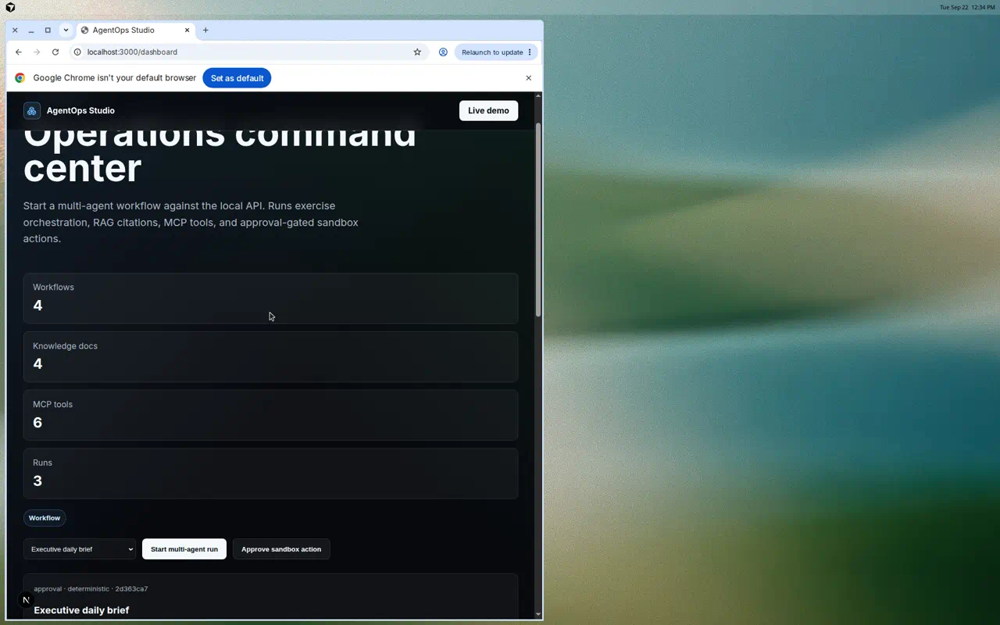
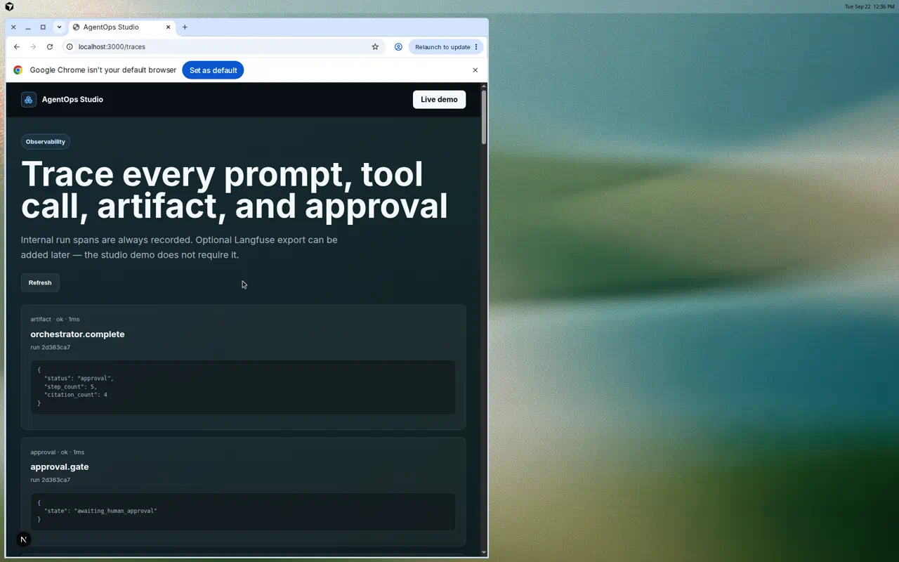
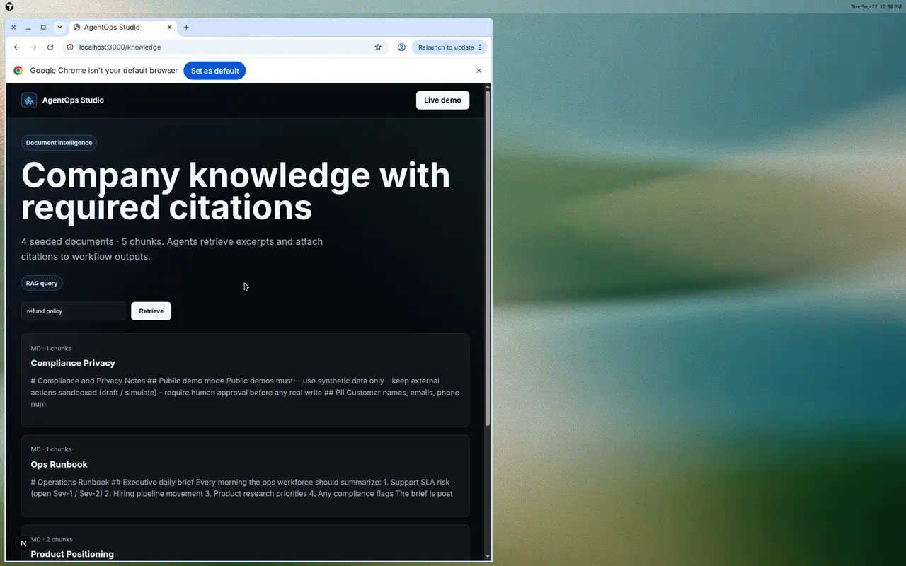
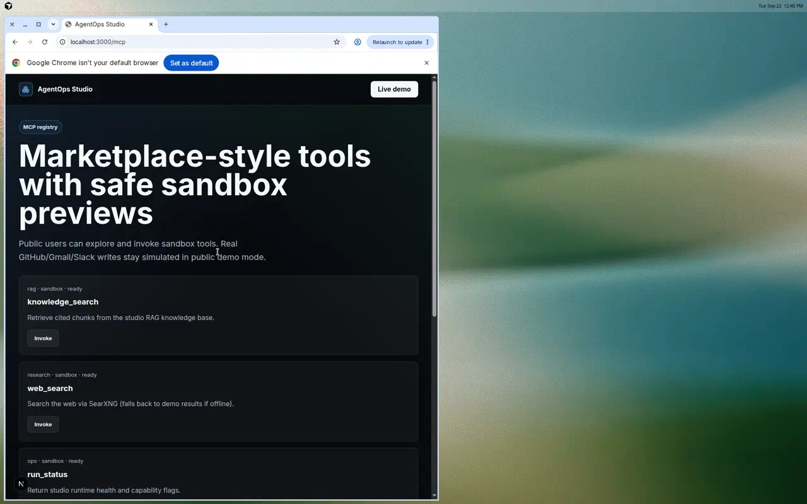

# HANDOFF — AgentOps Studio demo completion

## What works

- **Multi-agent orchestration** — `POST /runs` executes specialist agent workflows (orchestrator → knowledge → research → compliance → tools).
- **RAG + citations** — seeded markdown in `demo-data/knowledge/` indexed at API startup; `POST /knowledge/query` and in-run citations.
- **MCP-style tools** — registry with `knowledge_search`, `web_search`, `run_status`, sandbox Slack/Gmail/GitHub.
- **Observability** — internal trace spans on `/traces` and per-run detail.
- **UI ↔ API** — Dashboard demo console, Workflows, Runs (Kanban), Knowledge, MCP, Traces.
- **Native verification** — `bash scripts/smoke.sh` + `npm run test:api` (6 pytest cases). **No Docker required.**

## How to demo (hiring manager) — native path

```bash
cp .env.example .env
npm install
bash scripts/dev-api.sh          # :8000
npm run dev:web                  # :3000
```

1. Open http://localhost:3000/dashboard  
2. Click **Start multi-agent run** (Executive daily brief)  
3. Inspect citations + artifact; approve the sandbox Slack action  
4. Open **Runs**, **Traces**, **Knowledge**, **MCP**

### Verified in this PR (Cursor cloud VM, no Docker)

- API smoke: health, platform, executive brief → approval with citations, traces, RAG query, MCP list
- `pytest`: 6 passed
- Web: Next.js service on :3000 against live API

## Optional Compose (Mac / local Docker only)

```bash
docker compose up
```

Not required for “done”. Compose / k8s / Terraform remain optional scaffolding.

## Product positioning

| Product | Role |
|---|---|
| **AgentOps Studio** (this repo) | Portable ops lab / scaffold — native-first demo |
| **Agent Fleet** | Separate Contabo-hosted product — do not conflate |

## Gaps (honest)

- Orchestration is deterministic studio mode (no paid LLM required); live model gateway is env-ready only.
- RAG is TF-IDF over chunks (not pgvector embeddings yet); Postgres/pgvector is optional Compose profile.
- MCP is an in-process registry, not remote MCP servers.
- Langfuse / Firecrawl are not running services (internal traces cover the demo).
- Terraform is README blueprints only (no `.tf` yet).
- Some secondary UI routes (builder/benchmarks/research) remain thin shells.

## Screenshots

Native demo (no Docker):

| | |
|---|---|
|  |  |
|  |  |
